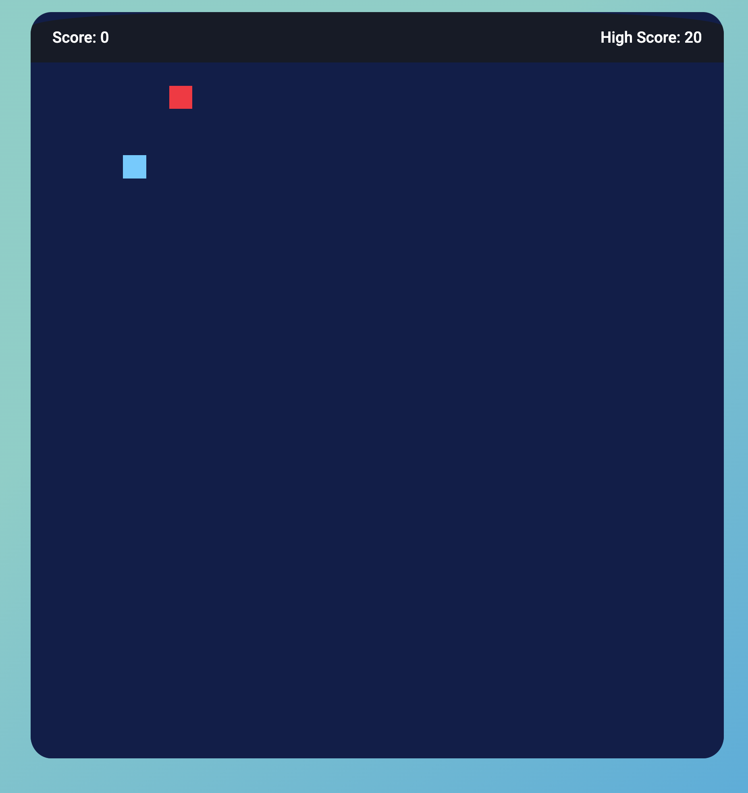

# Feed the Snake!

After learning JavaScript I decided to create a game. That's when the idea came to me to create the most addictive game of my youth. I remember very well playing this game on the Nokia. So I decided to create a version of the Snake Game.

The game is meant to be enjoyed and to bring back good memories for users.

[See deployed website](https://goncalves95.github.io/snake_game/)

## Table of content

- [Feed the Snake!](#feed-the-snake)
  - [Table of content](#table-of-content)
  - [Design and User Experience](#design-and-user-experience)
    - [Design](#design)
  - [Features](#features)
    - [Footer](#footer)
    - [Home Page](#home-page)
    - [Game Page](#game-page)
    - [404 Error Page](#404-error-page)
  - [Testing](#testing)
    - [Tests](#tests)
    - [Validator Testing](#validator-testing)
    - [Fixed Bugs](#fixed-bugs)
    - [Unfixed Bugs](#unfixed-bugs)
    - [Performance](#performance)
  - [Deployment](#deployment)
    - [Live Website](#live-website)
  - [Credits](#credits)
    - [Content](#content)
    - [Media](#media)
  - [Technologies used](#technologies-used)

## Design and User Experience

### Design

The design of the website is minimalist, and the same time fun, for the user can experience a game page simple and concentrated on the game.

Fonts:

- Roboto - This font is visible throughout the structure of the site

Colours:

--DarkBlue: #111D4A;
--LightBlue: #0093E9;
--Black: #171B26;
--White: #ffffff;
--Red: #FF003D;
--Green: #008000;

## Features

There are tree pages: Home page, Game page and 404 Error page:

- On the Home page, we can find a large start button, referring to the world of games and interacting with the user to press start. There is also an animated backgroud. On this page we can also find a short message for users to have a better experience with the game and a footer with the author's name and the link to the GitHub page.
- On the Game page, we can find a Header, the game div and a footer with the social media icons and copyrights.
- On the 404 Error page the user can find the big numbers 404 with animation, the mensage "page not finde", one link to come to home page and a footer with the author's name and the link to the GitHub page.

### Footer

- __Footer__

  - The footer on  game page contains:
    - copyrights
    - social media links

  - When clicking on the social links, this gone open in a new tab.

  - The footer on home page and 404 page contains:
    - copyrights
    - gitHub icon

  - When clicking on the gitHub link, this gone open in a new tab.

### Home Page

- __StartButton__

The homebage containg the information about the company. In particular it contains two distinc sections:

- The Algarve, one smal paragraph for descrive the Algarve, where is the work region of the company.

- The about, where the user can finde and read what the company do and what can expect from them.

- __Information Users__

  - A welcome message for the user.
  - In this section I have placed a small text to inform the user for have the best experience its recomended playing on laptop or computer.  
  - And a nice message to Good Game.

 

### Game Page

- __Header__

  - This is the landing page for our users, so it has an header for fun.

- __Game Area__

  - This area contains the div where the JavaScript code was developed. In this area we find a field of blocks where the rats (the snake's food) will appear and where the snake will travel to catch all the rats. .

- __Game Area on Small Screens__

  - What's different about the es area compared to the web is that for small screens I've added control keys on the screen (in the game div).

- __Score Area__
- In the score area, you can find the score of the current game on the left and the maximum score achieved in that section on the right.

### 404 Error Page

- On the 404 error page, you can find the 404 error numbers with a small color animation. Next we find the page not found information.
- In the message Return to home page, if the user clicks on it, they will be redirected to the home page.

## Testing

To test my game I have opened it on different devices, to see if it was working as expected.

- Browser tested:
  - Chrome
  - Firefox
  - Safari

- Operating systems:
  - Android
  - iOS

### Tests

  

  
General

  |Action | Expected behavious | Result|
  |-------|--------------------|-------|
  |Copy url of the browser and paste it in browser. Press enter | Browser should load index.html | Pass |
  |Scale up the window | The contentent should not stretch over a certain size | Pass |
  |Scale down the window | The contentent should be visible without having to scroll horizontally | Pass |

  

  

  
Footer

  |Action | Expected behavious | Result|
  |-------|--------------------|-------|
  |Click on the LinkedIn icon in the footer | It should open LinkedIn in a new tab | Pass |
  |Click on the TikTok icon in the footer | It should open Facebook in a new tab | Pass |
  |Click on the Youtube icon in the footer | It should open Facebook in a new tab | Pass |
  |Click on the GitHub icon in the footer | It should open Facebook in a new tab | Pass |

  

  

  
Game

  |Action | Expected behavious | Result|
  |-------|--------------------|-------|
  |When you press the navigation keys on the keyboard, the snake's body should start to move  | Pass |
  |When you press the navigation keys on the keyboard, the snake's body will move to the side of the arrow you press | Pass |
  |When the snake's body goes over the edge of the game area it should return GameOver | Pass |
  |When GameOver is triggered, a GameOver alert should appear | Pass |
  |When the snake's body passes the mouse, it must disappear and add 1 point to the body  | Pass |
  |When the snake's body passes through its own body, it must return GameOver  | Pass |

  

### Validator Testing

- HTML
  - No errors were returned when passing the final version through the official [W3C validator](https://validator.w3.org/nu/#textarea)
  - 
- CSS
  - No errors were found when passing the final version through the official [(Jigsaw) validator](https://jigsaw.w3.org/css-validator/validator)
  -  

### Fixed Bugs

### Unfixed Bugs

### Performance

I have tested the performance in chrome, using lighthouse:

- Performance rate:

   

  
 Desktop 

  
- Home page:

   

- Game page:

   

- 404 Error page:

   

  
 Mobile 

  
- Home page:

   

- Game page:

   

- 404 Error page:

   

## Deployment

### Live Website

- The site was deployed to GitHub pages. The steps to deploy are as follows:
  - In the GitHub repository, navigate to the Settings tab
  - From the Code and automation section drop-down menu, select the Pages.
  - In the build and deployment area, choose from source "deply from a branch" and after in Branch choosse the main branch and root and save.
  - Once this is save, the page will be automatically refreshed with a detailed ribbon display to indicate the successful deployment (he take me more less 5 minutsfor appear the link).

The live link can be found here - [Live Website](https://goncalves95.github.io/snake_game/)

## Credits

### Content

- Ideas and some code  take and lerned for the snake game: [MundoJS](https://www.mundojs.com.br/2020/06/05/criando-jogo-snake-em-javascript-e-canvas/) [Rodrigo Gomes](https://codepen.io/digoart/pen/VgoVmj) [Programador BR](https://www.youtube.com/watch?v=Hua1OSXitdQ)
- Typewrite como inspiration from [Rodrigo Gomes](https://codepen.io/rodrigofrumento/pen/GRZXpWa) [Acervo Lima](https://acervolima.com/como-criar-animacao-de-maquina-de-escrever-usando-html-e-css/)
- Lerning the CSS @keyframes Rule on [W3School](https://www.w3schools.com/cssref/css3_pr_animation-keyframes.php)
- The icons in the footer were taken from [Font Awesome](https://fontawesome.com/)
- Instructions on how creat a animated backgroud in the form were taken from [Alvaro Trigo](https://alvarotrigo.com/blog/animated-backgrounds-css/)
- 
- The following fonts, used for the project, are from [Google Fonts](https://fonts.google.com/):
  - Roboto

### Media

- Image for FavIcon [gratispng.com](https://www.gratispng.com/png-bk4p3c/)
- Image for the start button [Flaticon](https://www.flaticon.com/br/icone-gratis/botao-de-inicio_5261101)
- Sounds taken from Pixabay.

## Technologies used

- HTML
- CSS
- JS